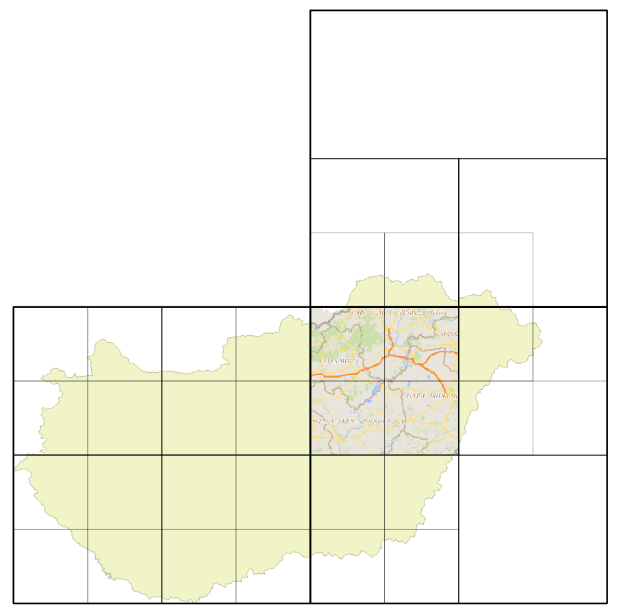

# wms-thief
> Bulk WMS tile downloader and georeferencer

With ```wms-thief``` you can download WMS images from a server to your local machine. You can define multiple scales for a single run. The tile geometry and metadata can optionally be saved in a PostGIS database in case you wish to visualize the tile vectors. Furthermore, you can use a mask layer as well.

After downloading, the images are georeferenced and converted into GeoTiff format, so you can easily add them to e.g. GeoServer as an image mosaic layer.

## Usage

1. To run ```wms-thief``` the usage of the [OSGeo4W shell](https://trac.osgeo.org/osgeo4w/) is recommended. You may have to install the [requests](http://docs.python-requests.org/en/master/) package locally with pip: ```pip install requests``` ([this is how you install pip](https://trac.osgeo.org/osgeo4w/wiki/ExternalPythonPackages))
2. Modify the run.py file to match your needs (see the code at the "user defined parameters" section)
  * set the WMS parameters such as url, image format, layer, crs, starting-ending coordinates etc.
  * optionally set the database connection
  * optionally add the [WKT (well-known-text)](https://en.wikipedia.org/wiki/Well-known_text) file location containing a (multi)polygon for using as a mask layer
3. Run the program from the command line: ```python run.py```
5. Please do not download private or sensitive data

## Example

<p align="center"></p>

## Author
```wms-thief``` was created by [Gergely Padányi-Gulyás](http://www.gpadanyig.com)